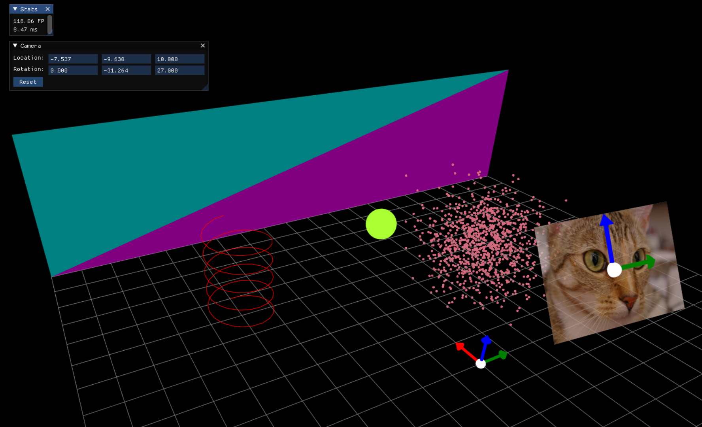

# `gg-open-core`
This repository is an open-source subset of tools and utilities originally developed as part of the closed-source repo `gg-core` for [GigaGoop](https://gigagoop.com).

GigaGoop was created to simplify property walkthroughs, enabling users to create high-quality 3D tours with just a smartphone. These tours eliminate the need for travel and scheduling, making it easier for potential buyers to explore properties remotely.

To achieve this, an extensive suite of tools was developed, including 3D visualization, synthetic RGBD generation using Unreal Engine, iPhone data capture software, and state of the art Neural Radiance Field (NeRF) algorithms.

The purpose of this open-source repository, `gg-open-core`, is to share some of these tools with the world. This release features our visualization library, `SpaceGraph`. At a high level, you can do something like:

```python
sg = SpaceGraph()
sg.plot(np.random.randn(10**6, 3))

# Do other stuff
```

and it will happily plot a million points for you ;-P.

`SpaceGraph` was created to provide an interactive 3D visualization tool, designed to work seamlessly in environments like iPython. It’s like a better, more interactive version of matplotlib’s 3D plotting.

⚠️ Documentation Warning ⚠️

We know, the documentation isn’t great (yet). This project is a work in progress, and we’re sharing it as-is for now. If you have questions or need help, feel free to open an issue or reach out! Contributions to improve the docs are welcome.

# Installation
You can run all the tools by installing a full environment with:
```
conda env create -f environment.yml
```

or instead, add those dependencies to your own environment.

# Getting Started
Start by running [ex_overview.py](examples/space_graph/ex_overview.py) to get an idea of how to use `SpaceGraph` - you'll get something like this:


# License
See [LICENSE.txt](LICENSE.txt).

# Testing
Before submitting a pull request, please validate the codebase by running `pytest`

# Coordinate Systems
When dealing with *coordinates*, everyone and their mom has a preference on which convention to use. In this section we provide a few nice figures that illustrate some of the many conventions out there when dealing with world and camera coordinate systems. See [get_world_coordinate_system](gigagoop/coord/transform.py#L507) and [get_camera_coordinate_system](gigagoop/coord/transform.py#L558) to map between all of the listed conventions.


